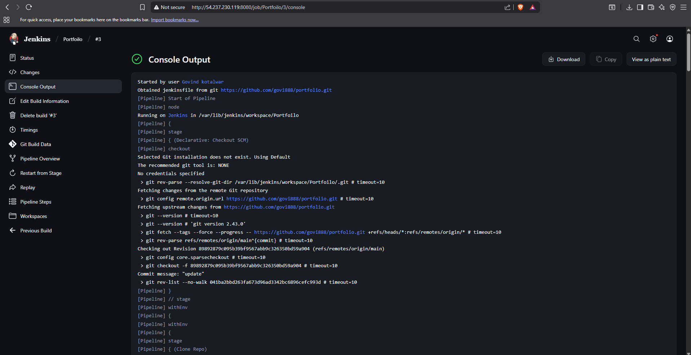
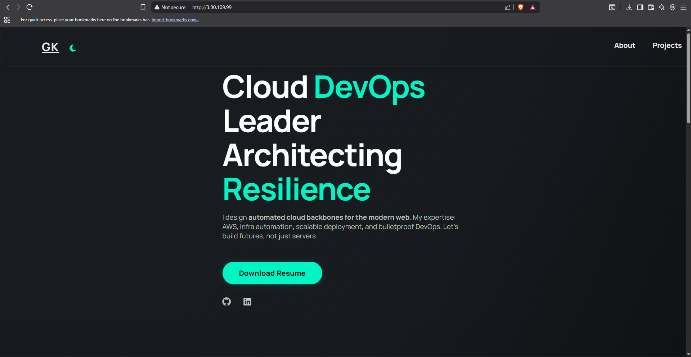
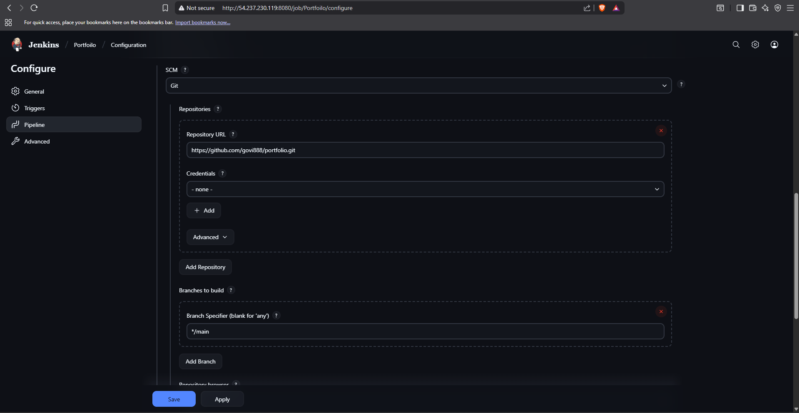

# 🚀 Portfolio Deployment using Jenkins CI/CD

This project demonstrates how to deploy a simple **Portfolio Website** from GitHub to an **Apache Web Server on AWS EC2** using a **Jenkins Master–Slave pipeline**.

---

## 📌 Project Overview
- Source code is stored in **GitHub** (`portfolio` repo).
- Jenkins pipeline fetches the repo and deploys it to an **EC2 instance**.
- Deployment ensures:
  - Apache/HTTPD installation (if not already installed).
  - Old files are removed.
  - Fresh `index.html` is uploaded and served via Apache.

---

## 🛠️ Architecture

1. **GitHub Repository** → Contains the `portfolio` website.
2. **Jenkins Master** → Triggers pipeline and delegates tasks.
3. **Jenkins Slave/Agent** → Executes build & deployment steps.
4. **EC2 Instance** → Hosts the portfolio on Apache server.

---

## 📂 Jenkins Pipeline Script

Below is the full `Jenkinsfile` used in this project:

```groovy
pipeline {
    agent any

    environment {
        SSH_CRED    = 'server'              // Jenkins credential ID
        SERVER_IP   = '3.80.109.99'         // EC2 IP
        REMOTE_USER = 'ubuntu'
        WEB_DIR     = '/var/www/html'
    }

    stages {
        stage('Clone Repo') {
            steps {
                git url: 'https://github.com/govi888/portfolio.git', branch: 'main'
            }
        }

        stage('Deploy to Apache Server') {
            steps {
                sshagent(credentials: ["${SSH_CRED}"]) {
                    sh '''
                        echo "Installing Apache if not installed..."
                        ssh -o StrictHostKeyChecking=no ${REMOTE_USER}@${SERVER_IP} "
                            if ! command -v apache2 >/dev/null 2>&1 && ! command -v httpd >/dev/null 2>&1; then
                                if [ -f /etc/debian_version ]; then
                                    sudo apt-get update -y
                                    sudo apt-get install -y apache2
                                    sudo systemctl enable apache2
                                    sudo systemctl start apache2
                                else
                                    sudo yum install -y httpd
                                    sudo systemctl enable httpd
                                    sudo systemctl start httpd
                                fi
                            fi
                        "

                        echo "Ensuring web root exists..."
                        ssh -o StrictHostKeyChecking=no ${REMOTE_USER}@${SERVER_IP} "sudo mkdir -p ${WEB_DIR}"

                        echo "Cleaning old files on server..."
                        ssh -o StrictHostKeyChecking=no ${REMOTE_USER}@${SERVER_IP} "sudo rm -rf ${WEB_DIR}/*"

                        echo "Uploading index.html to /tmp on server..."
                        scp -r index.html ${REMOTE_USER}@${SERVER_IP}:/tmp/

                        echo "Deploying file to Apache directory..."
                        ssh -o StrictHostKeyChecking=no ${REMOTE_USER}@${SERVER_IP} "sudo cp -r /tmp/index.html ${WEB_DIR}/"
                    '''
                }
            }
        }
    }
}
````

---

## ✅ Prerequisites

* Jenkins Master & Slave configured.
* AWS EC2 instance with:

  * Security group allowing **SSH (22)** and **HTTP (80)**.
  * Correct SSH key in **Jenkins credentials**.
* GitHub repository containing `index.html`.

---

## ⚡ How It Works

1. Jenkins pipeline triggers on demand.
2. Code is cloned from GitHub.
3. Jenkins connects to EC2 via SSH.
4. Apache is installed if missing.
5. Website files are deployed to `/var/www/html`.
6. Portfolio is accessible via `http://<EC2-PUBLIC-IP>`.

---

## 📸 Screenshots

### 1. Jenkins Pipeline Success


### 2. Portfolio Website on Browser


### 3. Jenkins Credentials (SSH Key Setup)


### 4. Jenkins Pipeline Running


### 5. Apache Server Running on EC2

---

## 🌐 Accessing the Site

Once deployed, visit:

```
http://3.80.109.99
```

---

## 📖 Future Enhancements

* Add CI/CD trigger on GitHub push.
* Add Nginx reverse proxy.
* Dockerize the portfolio.
* Add monitoring with Prometheus/Grafana.

---


